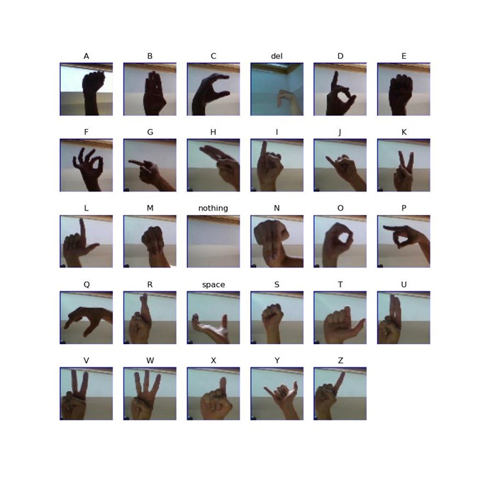
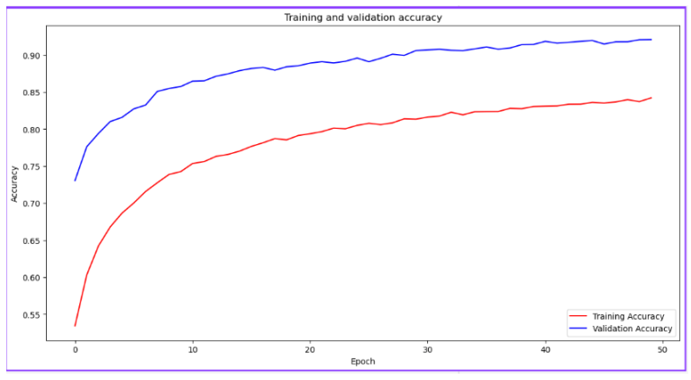
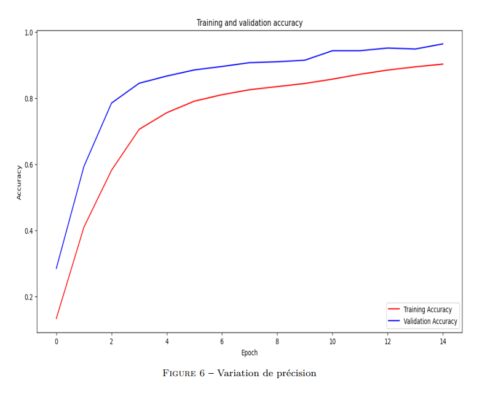
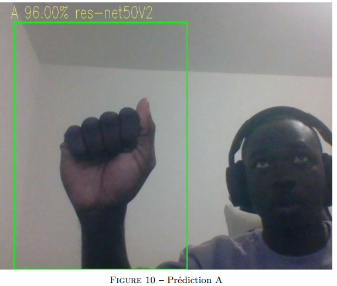
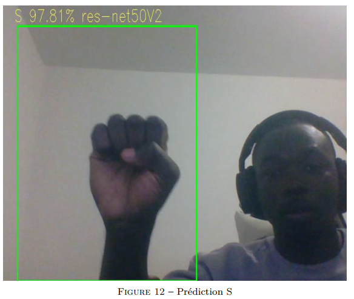

# Reconnaissance de l'alphabet en langue des signes américaine à l'aide de Resnet50V2

## Contexte
Nous constatons que l'intelligence artificielle existe pour aider à résoudre des problèmes, pourtant elle est aussi connue pour être biaisée contre les personnes marginalisées comme les malentendantes. C'est pourquoi dans ce projet, nous avons developpé un programme en utilisant **Resnet** (réseau neuronal artificiel qui permet de résoudre le problème de disparition du gradient.) pour transcrire la langue des signes americaine en langue écrite.

## Objectifs
- Développer un modèle d'apprentissage automatique pour transcrire les signaux manuels des alphabets avec un haut niveau d'adaptabilité à divers endroits;
- Obtenir une performance globale permettant la prediction en temps réel et qui distingue les gestes similaires tels que "A" avec "E", "M" et "S";
- Comparer l'apprentissage à partir de Zéro et l'apprentissage par transfert.

## Méthodologie
Nous avons développé notre modèle avec **python** en utilisant la bibliothèque **Keras** et démontrer en temps réel avec **OpenCv.**

- **Dataset** : Les données utilisés proviennent de [Kaggle](https://www.kaggle.com/datasets/grassknoted/asl-alphabet), ce sont **87 000** images de taille **200 x 200** que nous avons redimensionnées à (64 x 64) pour un compromis avec la puissance de calcul que l'on dispose.

- **modèle** : Nous avons utilisé l'implementation du Resnet50V2 pour former notre modèle à partir de Zéro sur le dataset, puis nous l'avons comparée au modèle préformé à adapter à notre tâche (apprentissage par transfert).

### Pile de technologie
- Python, notebook
- Tensorflow, Keras, OpenCV

## Résultats
Après avoir formé les modèles, nous avons obtenu les résultats suivants.

### Entrainement à partir de Zero

Nous avons obtenu un **f1-score** de **92 %** sur 50 epochs, en entrainant notre modèle à partir de zéro.

### Apprentissage par transfert

Nous observons une croissance exponentielle de la précision au début de la formation puis elle se stabilise à partir du 8e epoch, le modèle a donc bien appris.

Nous avons obtenu globalement un **f1-score** de **97 %** . Nous acceptons ce modele car sa performance est grandement significative ( > **95 %**)
Il est donc évident qu'utiliser l'apprentissage par transfert présente des avantages en gain de temps et l'amélioration de la performance.

### Predictions en temps réel
Notre modèle a atteint des performances de prediction impressionnantes où, dans la plupart des cas, des predictions précises ont été faites et soutenues par un taux de confiance significative (> **90 %**). Il faut noter que le modèle à réussi a distingué même les gestes les plus similaires tels que "A" avec "E" et "S", "U" avec "V" et "W"

## Conclusion et perspectives
- En conclusion , nous avons pu créer un système de reconnaissance de l'alphabet **LSA** à l'aide de ResNet-50 préformé de la bibliothèque **Keras** et mettre en oeuvre la prediction en temps réel avec **OpenCv**. Le système arrive a une précision de **97 %**.
- Les projets impliquant des images peuvent être fortement affectés par de nombreux facteurs tels que la distance de l'objet (la main dans ce projet) et la résolution/luminosité de l'image capturée à partir de la vidéo en direct. Afin de gérer les facteurs comme les objets se trouvant dans l'image affectant la prediction, nous conseillons de combiner ce modèle avec un modèle de détection d'objets comme **YOLO**.

Nous espérons que ce projet constituera la base pour les futurs projets traitant de la langue des signes.

## Contributeurs

Made with [contrib.rocks](https://contrib.rocks).
